## Project Overview, Usage, and Highlighted Features

**Project**

- Local ISO 27001 audit-readiness platform for Windows-based environments
- Combines a React frontend, FastAPI backend, ML-assisted scoring, RAG retrieval, and local Qwen reasoning

**How It Is Used**

- Define audit scope and boundaries
- Discover and classify assets, then assess threats, controls, and risk
- Generate treatment actions, evidence rows, guide documents, and final deliverables in one workflow

**Highlighted Features**

- ML-assisted asset role prediction and user-behavior risk scoring
- RAG + Qwen reasoning for control selection, treatment generation, evidence generation, and downloadable guides
- Final Deliverables and AI/ML Performance Dashboard views built from the same workflow data

---

## ISO 27001 Audit Readiness Dashboard

Overall workflow progress, KPI snapshot, and current audit status.

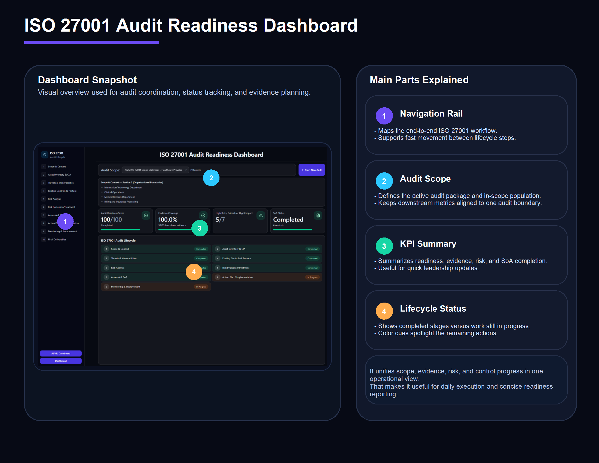{width=100%}

---

## Scope & Context

Defines the audit boundary, organizational scope, and baseline audit package.

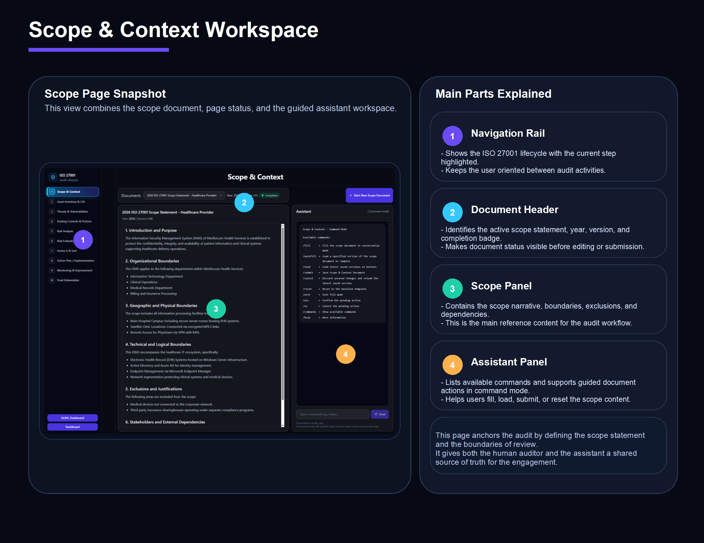{width=100%}

---

## Asset Inventory & CIA

Builds the inventory, applies role assignment, and sets CIA ratings for assets.

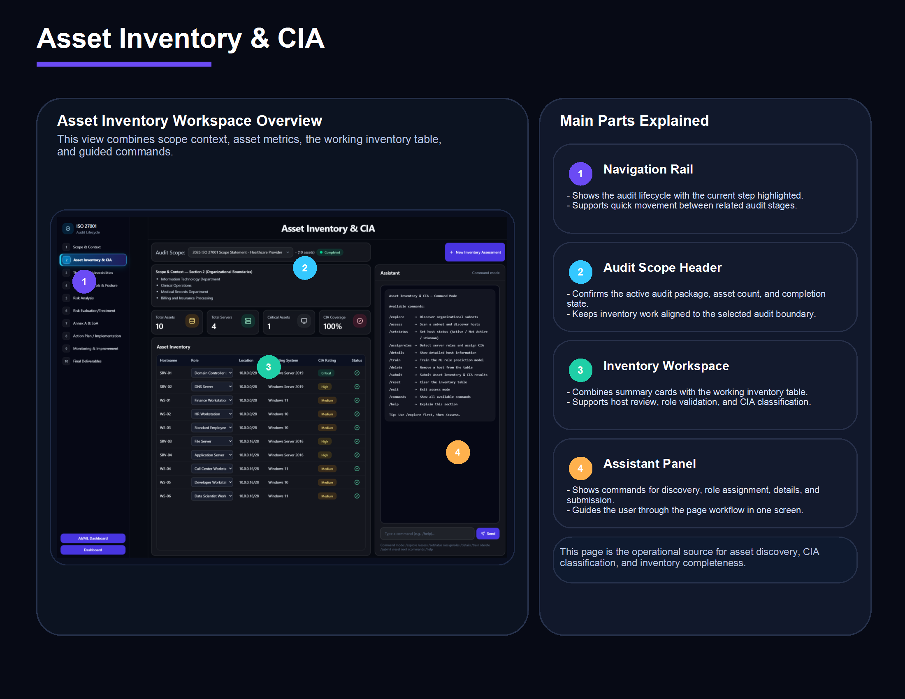{width=100%}

---

## Threats & Vulnerabilities

Maps each host to vulnerabilities and threat context for the assessment.

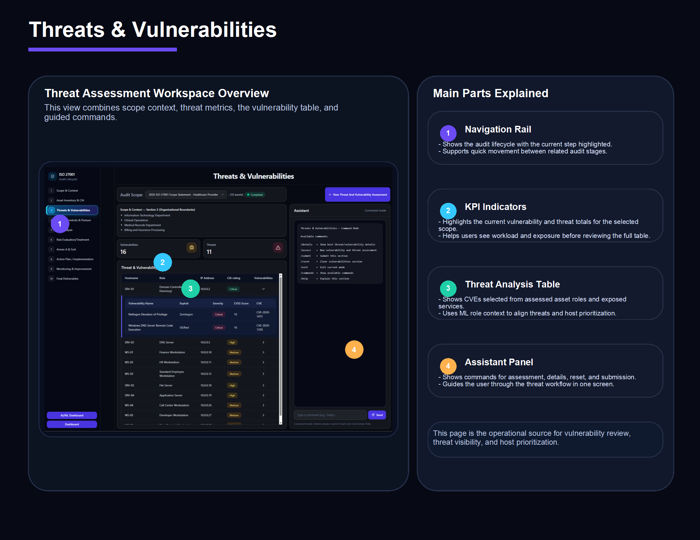{width=100%}

---

## Existing Controls & Postures

Captures live or fallback control evidence and current security posture by host.

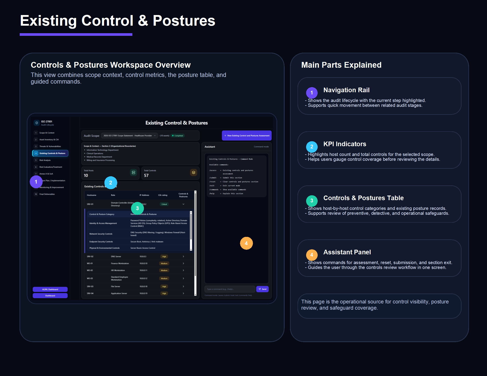{width=100%}

---

## Risk Analysis

Combines CVEs, CIA context, and user-behavior scoring into host-level risk records.

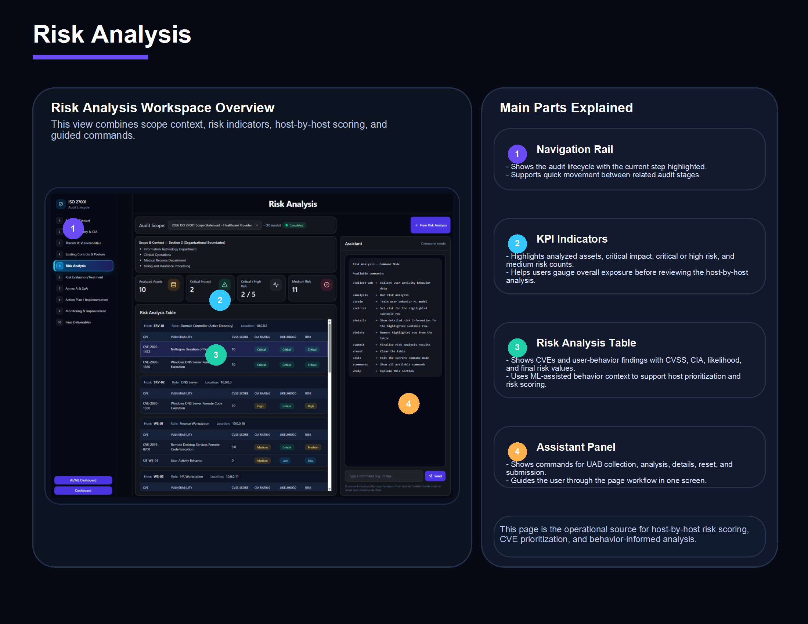{width=100%}

---

## Risk Evaluation & Treatment

Converts analyzed risk into treatment decisions such as mitigate, monitor, or accept.

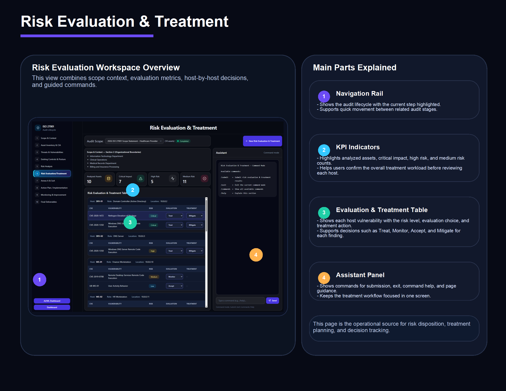{width=100%}

---

## Annex A & SoA

Uses ISO control mapping to build the Statement of Applicability from the risk context.

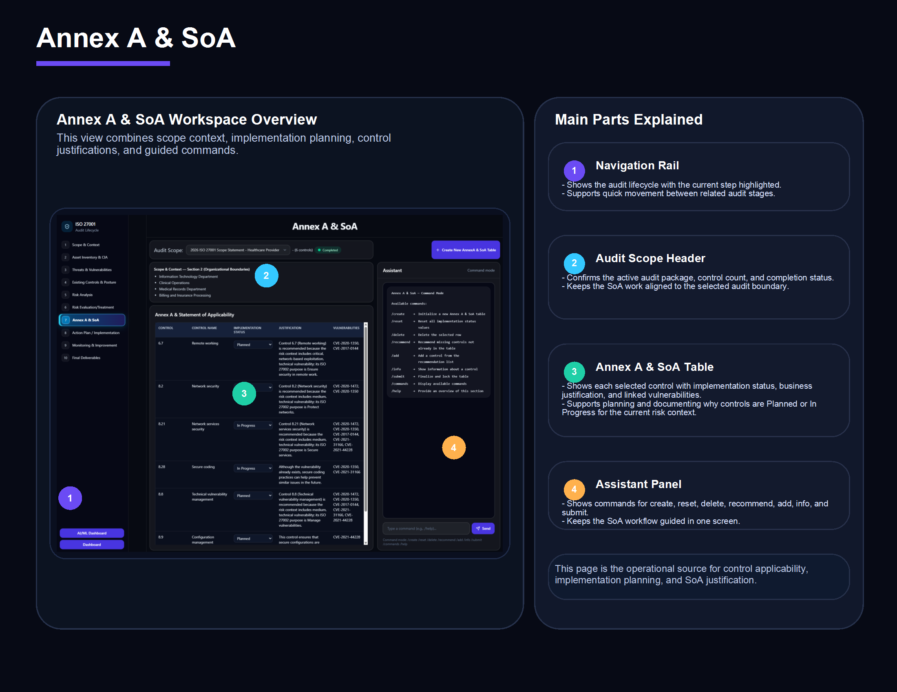{width=100%}

---

## Action Plan / Implementation

Generates implementation actions, evidence rows, and guide documents for treated items.

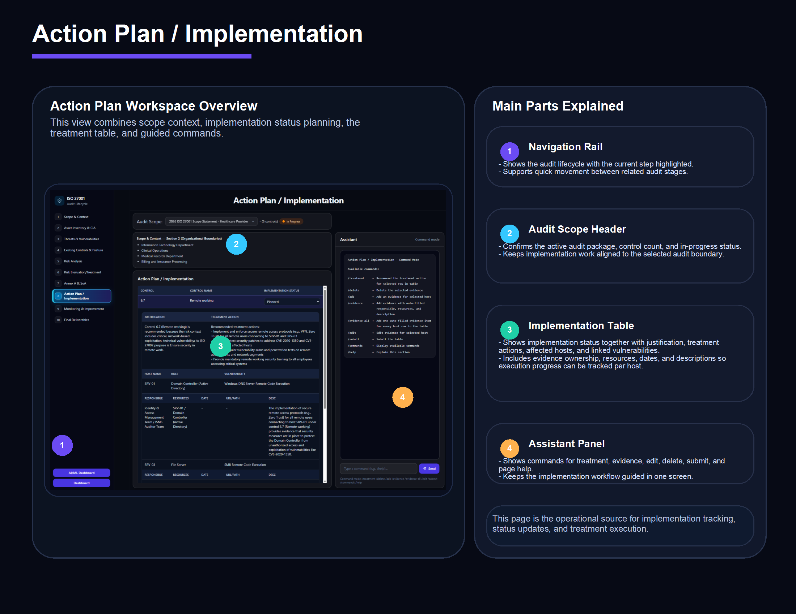{width=100%}

---

## Monitoring & Improvement

Builds monitoring actions, evidence rows, and guide documents for items under observation.

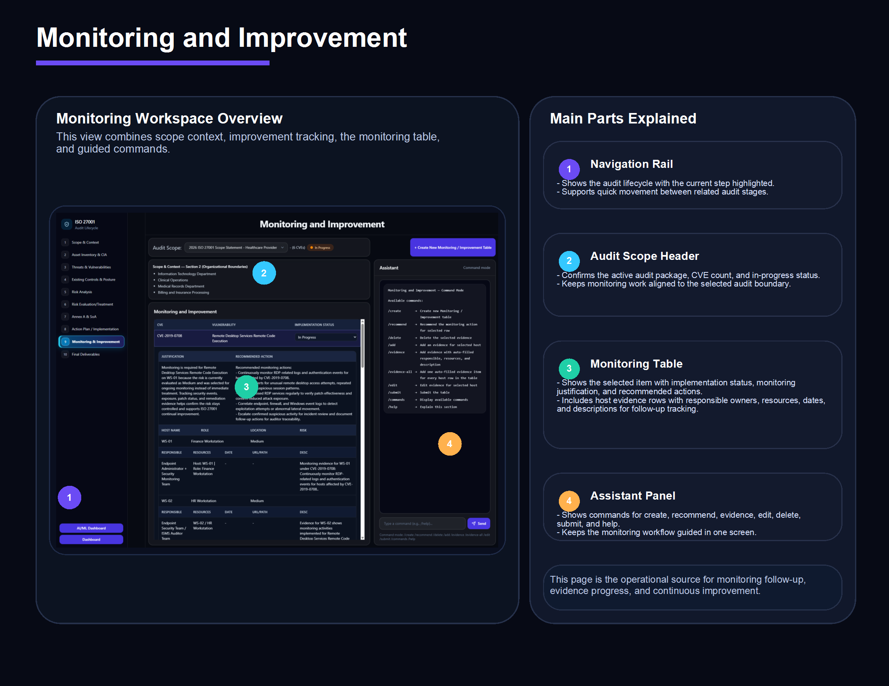{width=100%}

---

## Final Deliverables

Consolidates the workflow outputs into audit-ready reports and exportable sections.

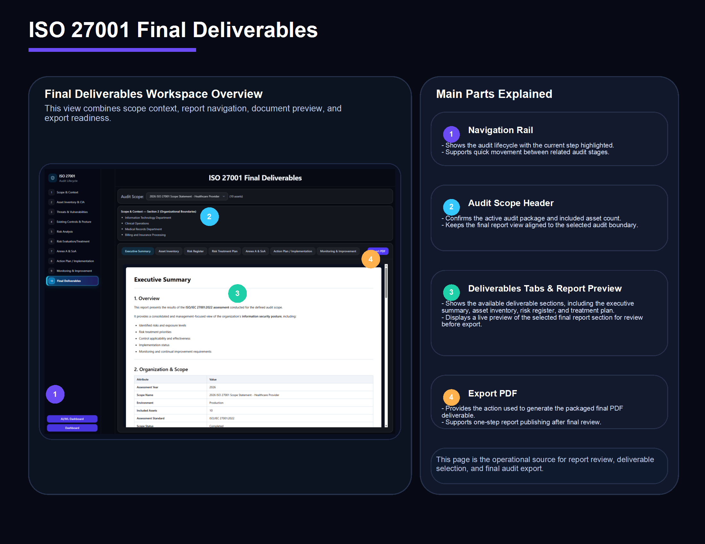{width=100%}

---

## AI/ML Performance Dashboard

Shows model metrics, RAG activity, local LLM usage, and dataset provenance.

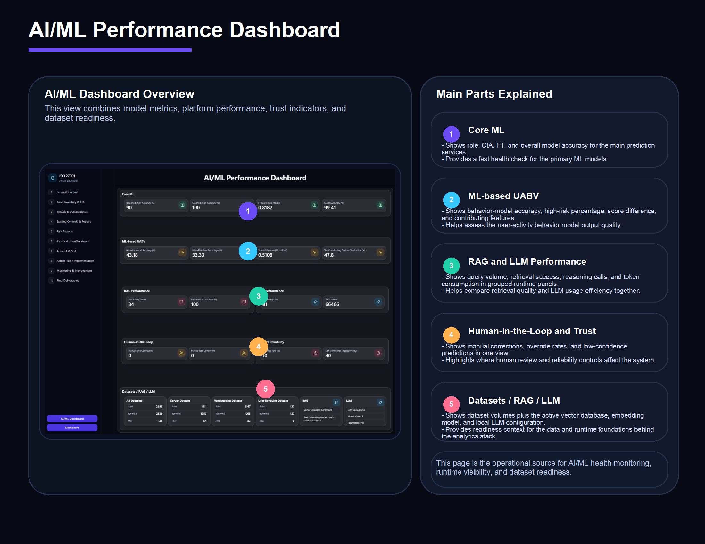{width=100%}
