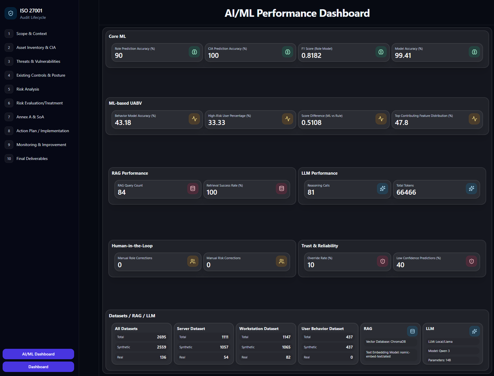

# FastAPI Routes

Backend API layer for the ISO 27001 audit workflow.

## Responsibilities

Route modules expose endpoints for:

- Scope & Context
- Asset Inventory & CIA
- Threats & Vulnerabilities
- Existing Controls & Posture
- Risk Analysis
- Risk Evaluation / Treatment
- Annex A & SoA
- Action Plan / Implementation
- Monitoring & Improvement
- Final Deliverables
- Dashboard and AI/ML Dashboard
- RAG, health, system status, and agent support

`aiml_kpi_telemetry.py` supports AI/ML KPI collection. `sections/` contains Final Deliverables section builders.

The application registers these routers from `app/main.py`.

## AI / ML and RAG Usage by Page

- `Asset Inventory & CIA`
  - Uses ML-assisted role prediction during asset role assignment and CIA workflow updates.
  - Uses two `RandomForestClassifier` models: one for server-role prediction and one for workstation-role prediction.
  - Uses the `server_role_training_dataset` and `workstation_role_training_dataset` datasets as the role-model training source.
  - Retraining happens when the page training action is run manually, when role assignment needs a model that is not ready yet, and again after the page is submitted so newly confirmed inventory records can be added back into the training datasets.
  - Performance is surfaced in the `AI/ML Dashboard`, mainly in `Core ML`, where role prediction accuracy, role-model F1 score, model accuracy, and CIA-related prediction indicators are kept, with supporting dataset counts shown in the dataset section of the same dashboard.

- `Risk Analysis`
  - Uses ML-assisted user behavior scoring to enrich host risk analysis with `ml_score`, probability-driven behavior signals, and combined risk scoring.
  - Uses a `RandomForestClassifier` for the user-behavior model.
  - Uses the `user_behavior_training_dataset`, which is built from collected or prepared user activity behavior records.
  - Retraining happens when the page training action is run manually, when analysis starts and the behavior model is not ready yet, and again when the page is submitted so the finalized behavior model is refreshed before risk analysis is locked.
  - Performance is surfaced in the `AI/ML Dashboard`, mainly in `ML-based UABV`, where behavior model accuracy, high-risk user percentage, score difference between ML and rule scoring, and top contributing feature distribution are kept.

- `Annex A & SoA`
  - Uses RAG plus local `Qwen 3` reasoning to retrieve the most relevant ISO control context and generate recommended control information.
  - Uses retrieval over embedded ISO control knowledge and then applies reasoning to map risk records to suitable controls, explain why they fit, and support adding recommended controls into the table.
  - RAG and reasoning activity for this page contributes to the `AI/ML Dashboard` sections `RAG Performance`, `LLM Performance`, and `Datasets / RAG / LLM`, where retrieval count, retrieval success rate, reasoning calls, token usage, embedding model, vector database, and local LLM details are kept.

- `Action Plan / Implementation`
  - Uses RAG plus local `Qwen 3` reasoning to generate treatment actions, refine control-aligned implementation guidance, and prepare evidence-related descriptions and supporting guidance content.
  - The reasoning flow is used when treatment actions are generated for selected controls and when implementation/evidence text is prepared for host-level action rows.
  - The downloadable guide document in this page is part of the same reasoning-supported workflow and gives step-by-step implementation and evidence-creation guidance for the selected action items.
  - RAG and reasoning activity for this page contributes to the `AI/ML Dashboard` sections `RAG Performance`, `LLM Performance`, and `Datasets / RAG / LLM`.

- `Monitoring & Improvement`
  - Uses RAG plus local `Qwen 3` reasoning to generate monitoring recommendations, prepare evidence fields, and support ongoing monitoring / improvement records for each tracked item.
  - The reasoning flow is used when the monitoring table is created, when recommended monitoring actions are generated for selected rows, and when evidence descriptions are prepared for monitoring artifacts.
  - The downloadable guide document in this page is part of the same reasoning-supported workflow and gives step-by-step monitoring and evidence-collection guidance for the selected improvement items.
  - RAG and reasoning activity for this page contributes to the `AI/ML Dashboard` sections `RAG Performance`, `LLM Performance`, and `Datasets / RAG / LLM`.
